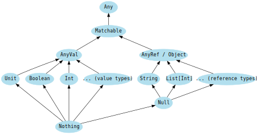
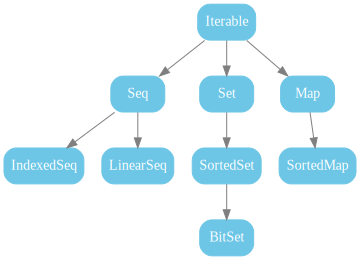

# Static diagrams (SVG)

These files live under `src/main/scala/learning/static/`. GitHub and most Markdown viewers render SVG images when linked with relative paths from the repo root.

## Type system

| File | Topic |
|------|--------|
| [`type-hierarchy.svg`](../src/main/scala/learning/static/type-hierarchy.svg) | `Any`, `Matchable`, `AnyVal`, `AnyRef`, `Nothing`, `Null` |
| [`type-casting-diagram.svg`](../src/main/scala/learning/static/type-casting-diagram.svg) | Widening casts between numeric types and `Char` |

## Collections (Scala collections overview)

| File | Topic |
|------|--------|
| [`scala.collection-high-level.svg`](../src/main/scala/learning/static/scala.collection-high-level.svg) | High-level traits: `Iterable`, `Seq`, `Set`, `Map`, sorted variants |
| [`scala.collection.immutable.svg`](../src/main/scala/learning/static/scala.collection.immutable.svg) | Default **immutable** concrete types (`List`, `Vector`, `HashMap`, …) |
| [`scala.collection.mutable.svg`](../src/main/scala/learning/static/scala.collection.mutable.svg) | **Mutable** counterparts (`ArrayBuffer`, mutable `Map`/`Set`, …) |

For performance characteristics and choosing a collection, see the [Scala 2.13 collections performance overview](https://docs.scala-lang.org/overviews/collections-2.13/performance-characteristics.html) (still a useful reference for Scala 3).
